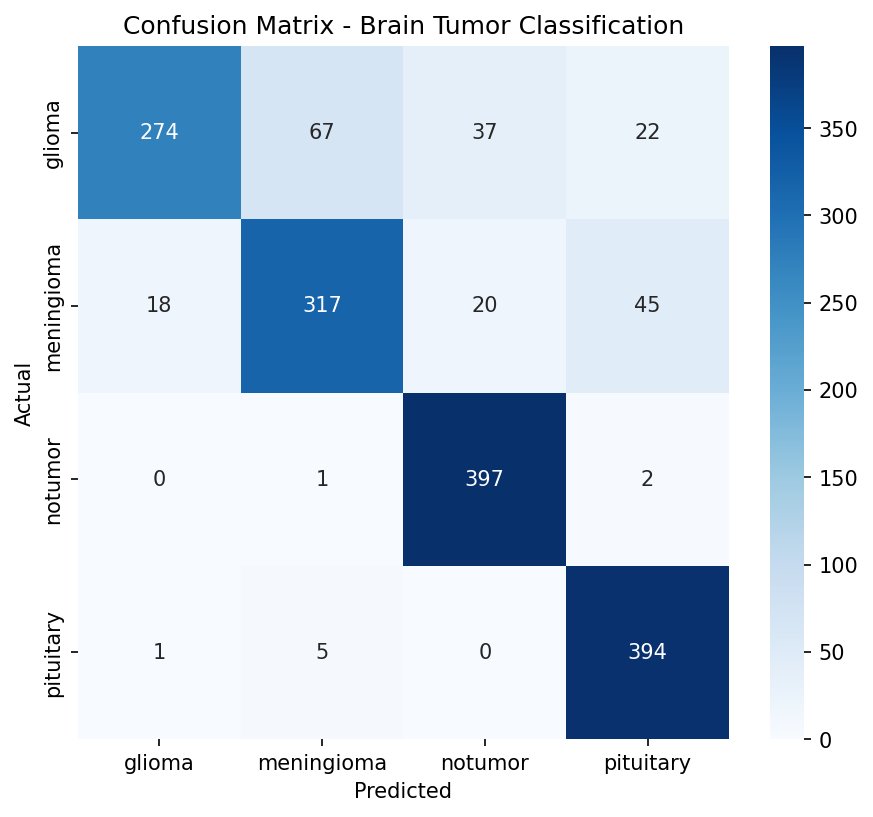
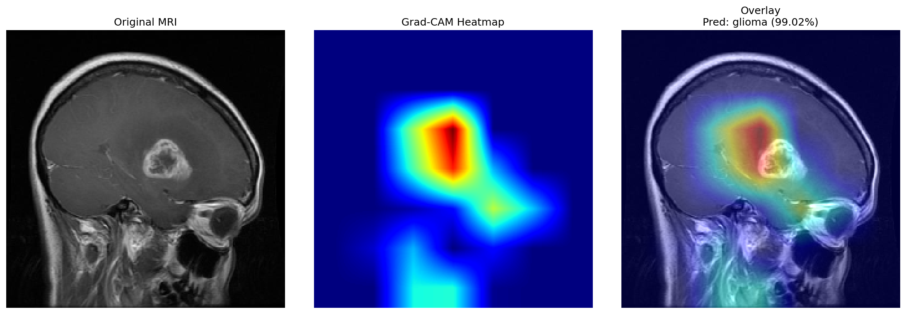
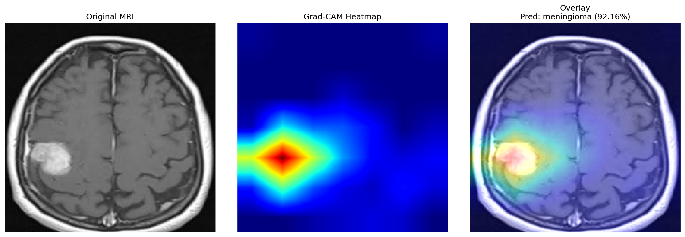
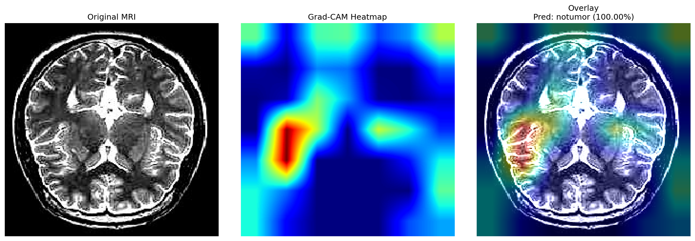
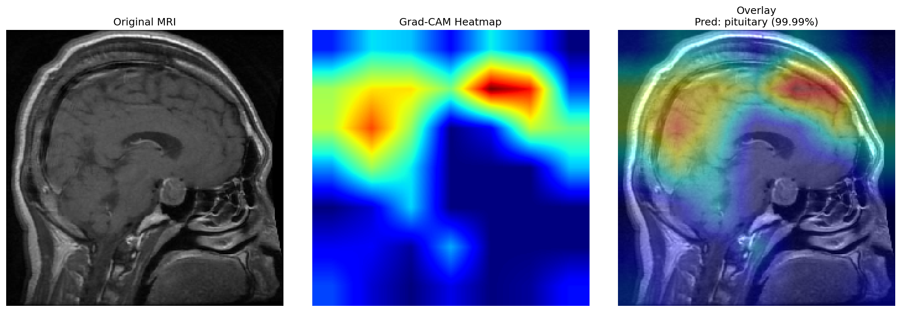

# 🧠 Brain Tumor MRI Classifier

A deep learning system that classifies brain MRI scans into four categories — **glioma**, **meningioma**, **pituitary tumor**, or **no tumor** — using transfer learning with EfficientNetB0, with Grad-CAM explainability to visualize what the model is actually looking at when it makes a prediction.

🔗 **Live demo:** [brain-tumor-mri-classifier-00.streamlit.app](https://brain-tumor-mri-classifier-00.streamlit.app/)

📓 **Training notebook:** [`notebooks/brain-tumor-model.ipynb`](notebooks/brain-tumor-model.ipynb)

---

## Why this project

Brain tumors often progress silently, and different tumor types call for very different treatment paths — a glioma might need aggressive surgery and radiotherapy, while a pituitary tumor is sometimes managed with medication alone. Misclassifying one as another risks the wrong treatment entirely.

This project isn't trying to replace radiologists — it's exploring whether a transfer-learning-based CNN can support that first classification step, and whether it can stay *interpretable* while doing it. A model that's 86% accurate but can't show its reasoning isn't very useful in a medical context, so Grad-CAM explainability was as much a goal here as the accuracy number itself.

## Dataset

[Brain Tumor MRI Dataset](https://www.kaggle.com/datasets/masoudnickparvar/brain-tumor-mri-dataset) (Kaggle) — ~7,000 MRI images across four classes:

- **Glioma** — originates in the brain's glial cells
- **Meningioma** — arises from the meninges surrounding the brain
- **Pituitary tumor** — found in the pituitary gland, which regulates hormones
- **No tumor**

## Approach

1. **Transfer learning**: EfficientNetB0 pretrained on ImageNet, with a custom head (GlobalAveragePooling → Dropout → Dense(128, relu) → Dropout → Dense(4, softmax)).
2. **Two-phase training**:
   - Phase 1 — base model fully frozen, train only the new head.
   - Phase 2 — unfreeze the last 20 layers of EfficientNetB0, fine-tune at a low learning rate (1e-5) so pretrained ImageNet features adapt to MRI-specific patterns without being wiped out.
3. **Augmentation**: rotation, shift, zoom, horizontal flip — helps generalization on a moderately-sized dataset.
4. **Explainability**: Grad-CAM on the final conv layer (`top_conv`), so every prediction can be visually checked against where the model actually focused.

## Results

Evaluated on a held-out test set of 1,600 images (400 per class):

| Metric | Score |
|---|---|
| **Test Accuracy** | **86%** |
| Macro F1 | 0.86 |

| Class | Precision | Recall | F1 |
|---|---|---|---|
| Glioma | 0.94 | 0.69 | 0.79 |
| Meningioma | 0.81 | 0.79 | 0.80 |
| No Tumor | 0.87 | 0.99 | 0.93 |
| Pituitary | 0.85 | 0.98 | 0.91 |




**What the numbers actually mean:** the model's weakest point is glioma recall (0.69) — it misses about 3 in 10 glioma cases. The confusion matrix shows why: 67 glioma scans got misclassified as meningioma, which is a known hard distinction even for radiologists since the two can look visually similar on MRI. More concerning, 37 glioma scans were misclassified as *no tumor* — the highest-stakes error type here, since that's the gap between flagging a scan for review and missing it completely. No tumor and pituitary, by contrast, are detected almost perfectly (99% and 98% recall).

I'm calling this out explicitly rather than just leading with "86% accuracy," because a single headline number hides exactly the kind of failure mode that matters most in a medical context.

## Explainability with Grad-CAM

Grad-CAM confirms the model is generally attending to clinically relevant regions rather than background artifacts. The meningioma example below is the clearest case — the heatmap lines up almost exactly with the visible tumor mass in the scan.

| Glioma | Meningioma |
|---|---|
|  |  |

| No Tumor | Pituitary |
|---|---|
|  |  |

## The debugging journey

This project didn't work on the first try, or the second, and I think the failures are worth documenting honestly rather than pretending the pipeline was smooth.

**1. Training stuck at exactly 25% accuracy.**
With four classes, 25% is the random-guessing baseline — and the loss was frozen at `ln(4) ≈ 1.386`, which meant the model wasn't learning at all. The cause: I was rescaling images to `[0,1]` with `ImageDataGenerator(rescale=1./255)`, but EfficientNetB0 (in current Keras) already has a `Rescaling(1./255)` layer built into the model itself. Images were being divided by 255 twice, shrinking every pixel value into a range so small the gradients effectively died. The fix was to stop rescaling manually and let the model's own preprocessing handle it.

**2. Grad-CAM couldn't find the conv layer.**
`model.get_layer('top_conv')` kept failing with a "no such layer" error, even though `top_conv` clearly exists in EfficientNetB0. The reason: when you use EfficientNetB0 as a sub-model inside a larger Functional model, its internal layers are nested one level down — `model.layers` only shows `efficientnetb0` as a single block, not its internals. The fix was to reach into the sub-model explicitly (`model.get_layer('efficientnetb0').get_layer('top_conv')`) and manually chain the remaining layers inside the `GradientTape` so gradients could flow correctly back through the nested structure.

**3. The deployed app gave the same prediction for every image.**
This one was the same root cause as bug #1, just resurfacing in a different file. When I split the Grad-CAM code out of the original notebook and into the Streamlit app, I'd re-added a manual `/255.0` division in the image preprocessing — not realizing the model still had its own built-in rescaling. Every uploaded image, regardless of content, was getting scaled down to near-zero values, so the model was effectively seeing "almost black" every time and defaulting to the same class. Removing the redundant division fixed it immediately.

**4. Deployment failed with a wall of `tensorflow-cpu` version errors.**
Streamlit Community Cloud's default environment was running Python 3.14, and no build of TensorFlow — CPU or otherwise — currently ships wheels for that version yet. The error message made it look like a dependency conflict, but it was actually a Python version problem. The fix was setting the Python version explicitly to 3.11 in the app's deployment settings, not in `requirements.txt` or a `runtime.txt` (which, as of now, Streamlit Cloud doesn't read for this purpose).

Each of these was a "silent" failure in the sense that nothing crashed loudly — the code ran, it just produced wrong results, which took longer to catch than an outright error would have. That's the pattern I'd flag to anyone doing similar work: with pretrained models especially, always check what preprocessing is already baked in before adding your own.

## Project structure

```
brain-tumor-mri-classifier/
├── notebooks/
│   └── brain-tumor-model.ipynb   # full training pipeline (Kaggle, GPU)
├── app/
│   └── streamlit_app.py          # deployed Streamlit demo
├── src/
│   ├── model.py                  # model loading
│   └── gradcam.py                # Grad-CAM implementation
├── results/
│   ├── brain_tumor_model.keras
│   ├── class_indices.json
│   ├── classification_report.txt
│   ├── confusion_matrix.png
│   └── gradcam_*.png
├── requirements.txt
└── README.md
```

## Running it locally

```bash
git clone https://github.com/sejalpandey30/brain-tumor-mri-classifier.git
cd brain-tumor-mri-classifier
pip install -r requirements.txt
streamlit run app/streamlit_app.py
```

Upload an MRI scan (JPG/PNG) and the app returns the predicted class, per-class confidence, and a Grad-CAM heatmap overlay.
The MRI images for sample test are provided locally on INPUT/MRI as tumor Images.

## Limitations

- Trained on a public, moderately-sized dataset (~7,000 images) — **not clinically validated and not intended for real diagnostic use.**
- Glioma recall (0.69) is the clearest weak point; see the results analysis above.
- No cross-institution validation — performance may not generalize to scans from different MRI machines or acquisition protocols.
- Grad-CAM shows *where* the model looked, not *why* — it's a useful sanity check, not a guarantee of correct reasoning.

## Tech stack

TensorFlow / Keras, EfficientNetB0, Grad-CAM, Streamlit, OpenCV, scikit-learn

## License

MIT License — see [LICENSE](LICENSE)
